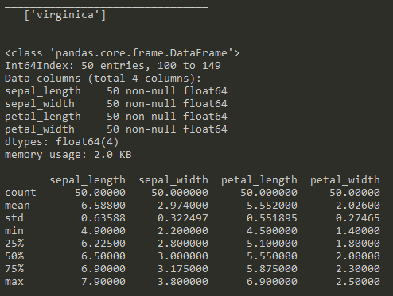

# Project 2019 #

### Programming and Scripting ###

## Galway Mayo Institute of Technology ##

 

**Student Name:** Seamus Leonard

**Student ID:** G00376550

**Contents**

<a href=#exec>Executive Summary </a>

<a href=#instr>Instructions</a>

<a href=#back>Background</a>

<a href=#data>The Data</a>

<a href=#anal>High level analysis</a>

<a href=#vis>Visual analysis</a>

<a href=#app1>Appendix A</a>

<a href=#app2>Appendix B</a>

<a href=#bibleo>Bibliography</a>

 

<h2 id="exec">Executive Summary</h2>
=================

The Iris dataset is a dataset of the measurements of petals and sepals of three species of Iris flowers. Published in 1936 by Ronald Fisher, it has become more fully known as the Fisher Iris Dataset. There are purportedly a number of versions of the dataset, some with stated errors.

Due to the integrity and uniformity of the dataset and the clear relationship between the values and the respective species of Iris flower, it is used as a dataset for Machine Learning. However, this document is designed to inform the reader about the dataset itself such that the reader can, without having viewed the dataset, talk with confidence of its contents.

The dataset has the following description

-   There are 150 rows of data in 4 columns (excluding the species name column)
-   The data is divided evenly between three species of flower such that each species has 50 rows of data
-   The three species of Iris flower are:

-   	*Setosa*
-   	*Versicolor*
-   	*Virginica*

-   From the analysis further in this document we can say that:

-   The petal length & width clearly distinguish *I. Setosa* from the other two species
-   The remaining two species (*I. Versicolor & I. Virginica*) can be distinguished with reasonable confidence based on cross-comparison of the petal and sepal dimensions.
-   More specifically, it is possible, with sepal width and length measurements to identify the species of Iris flower which can be validated against the petal length and width

     

<h2 id="instr">Instructions</h2>
============

This document is paired with two pieces of software which are co-located in this repository. These are:

+ Project2019.py
+ basicData.py

It is important that when you are saving the software that they are saved in the same folder as this document.

Running the software requires that you have Python installed. This software and installation instructions can be downloaded from <a href=http://www.python.org>Python</a>. However, if you are using Python, you will need to install the PANDAS, NUMPY and SEABORN packages. However, if you download and install <a href=www.anaconda.com>Anaconda Python</a> these packages come pre-installed.

Whilst the software can be run from Windows Shell (search for CMD from the taskbar), a useful tool which interacts well with Anaconda is CMDer  which can be downloaded from <a href=www.cmder.net>CMDer</a>.

From either of these Command Line Interface tools, move to the folder you’ve saved this document and the scripts to using ‘CD \[path\]’. Once you’re in the folder enter ‘Python’ followed by a space and then the name of the script you wish to run. The software runs from beginning to end. With ‘Project2019.py’, a sequence of graphs will be displayed. In each instance you have the opportunity to save the graph as an image using the save icon (floppy disk image). However, you must close each graph in turn to proceed to the next graph. This is done by clicking on the ‘X’ at the top right of the graph screen.

<h2 id="back">Background</h2>
==========

The Iris Dataset was collected by Edgar Anderson in 1935 and published by Ronald Fisher in 1936 (Wikipedia, 2019). It is a set of measurements of three species of Iris flowers. The measurements taken are:

-   Petal length
-   Petal width
-   Sepal length
-   Sepal width

*Photo 1 Iris Flowers (Willems, 2018)*

Fifty of these measurements were recorded for each of the three species of Iris flower giving a dataset of 150 rows and 5 columns. The measurements of width and length are decimal numbers to one decimal place precision. The fifth column holds a text value denoting which species of Iris flower the measurements are associated with.

However, recent studies have shown that there is more than one Iris data set in the public domain. Indeed, Bezdek et al (Bezdek, 1999) found that there is at least one other version which has errors in the dataset.

Notwithstanding the above, the Iris dataset (in its various versions) has been used both as a pedagogical tool and as a test dataset for Machine Learning (ML) algorithms (Joseph, 2018). Machine Learning being defined as “teaching computers how to learn without the need to be programmed for specific tasks. In fact, the key idea behind ML is that it is possible to create algorithms that learn from and make predictions on data” (Maglaras, 2018)

This document will explore the Iris dataset with a view to describing it such that the reader can know what it contains and tells.

 

<h2 id="data">The Data</h2>
========

### High Level overview ###
-------------------

As with any dataset, the first step in the process is to visually look through the dataset to:

1.  Understand what the data contained shows
2.  Get a sense of the data
3.  Be aware of any errors or anomalies
4.  Know the key attributes of the data

### Visual inspection ###

Having browsed visually over the data, all columns seem to be homogenous. However, we can get Python to perform a quick overview of the data using *info()*. From this we have:

*Screen-grab 1 Information*

This shows that:

-   There are 150 rows in the data
-   There are 5 columns in the data
-   There are no *NULL* values in any of the data
-   The 4 length and width columns are decimal data (float64)
-   Each column has a specific label

### Closer examination ###

We can further see from counting the rows by ‘species’ type that:

*Screen-grab 2 Value Counts*

This shows that the data is spread evenly amongst three values in ‘species’. Namely; ‘virginica’, ‘setosa’ and ‘versicolor’ with 50 rows of data each.

Two separate scripts were written to examine the dataset. The code for the first of these, from which the graphs in this document were derived, can be seen in <a href=#app1>Appendix A</a>. The second script which provides a high-level analysis of the dataset can be seen in <a href=#app2>Appendix B</a>.

<h2 id="anal">High level analysis </h2>
===================

### The data ###
--------

The Iris dataset contains three subsets of data. One for each species of Iris in the dataset. In looking at the data we can parse the dataset into its three subsets and examine the data from the following standpoints:

-   Is the data intact. Are there empty values, gaps, errors?
-   What are the maximum, minimum, standard deviation, mean and Inter-quartile range (IQR) values?
-   Are there outliers in the data subsets?

If the data is intact and have no (or almost no) outliers then we can start to make assumptions (prove hypotheses) based on the data.

### Subsets ###
-------

From ‘Screen Grab 2 Value Counts’ above, we can see there are three distinct species of Iris referred to in the dataset. These are:

-   Setosa
-   Virginica
-   Versicolor

Using the modules PANDAS and NUMPY within Python, we can import the data, examine it for outliers and report on the variables (Min, Max, Mean, StDev & IQR). An 
outlier was described by Moore and McCabe (1999) as an observation which lies outside the overall pattern of a distribution. Renze J. (2019) states that "a convenient definition of an outlier is a point which falls more than 1.5 times the Interquartile Range (IQR) above the third quartile or below the first quartile". This definition is based on using the IQR as the standard of measurement. An outlier was also described by Khandelwal R. (2018) as being "a data point in a dataset that is distant from all other observations. A data point that lies outside the overall distribution of the dataset". However, whilst Khandelwal also defines an outlier as being 1.5 times the IQR, he also uses the Z-Score as the standard of measurement. The Z-Score is based on the Standard Deviation and a data point is considered an outlier if it is more than 2 Standard Deviations from the mean (Khandelwal 2018). The appropriateness of their use is dependent on the type of data being observed and the influencers. For example, in measurements centred around a mean (such as length, width or height) using the StDev as the measure is appropriate as the distribution is normally approximate to a bell-curve. However, where the distribution isn't a bell-curve (such as volume of traffic during the day which would show three peaks at morning, lunch and evening), using the IQR as the measure is usually more appropriate.

The script in Appendix B was designed such that (with little modification) it can be used on any similar dataset containing numerical variables for given groups.

The output from this analysis is as follows:

### Setosa ###

Statistical values

*Screen-grab 3 - Statistical Values Setosa*
 
Outliers

*Screen-grab 3a - Outliers in Setosa*

### Versicolor ###

*Screen-grab 4 Statistical Values Versicolor*

 

### Virginica ###

*Screen-grab 5 Statistical Values Virginica*

 

### Conclusion ###
----------

In summary, in the Iris dataset there are four numerical variables and one categorical variable with 50 rows of data in each category and no null values. Except for one value in one species, there are no outliers, no errors and no null values in the dataset.

As a result of this, the raw data would suggest that we may be able to distinguish between three species of the Iris flower based on four measurements. However, whilst looking at the statistical data values will assist the reader in understanding the differences between the Iris species, it is in visualising the data; seeing how the data is displayed on a chart that the reader can immediately tell the differences in the data.

<h2 id="vis">Visual analysis</h2>
===============

Whereas a visual inspection of raw data will give us an understanding of the integrity of the data, using python, we can start to examine the Iris dataset at a high level visually. Being able to see how the data is represented on a graph gives us a more immediate decision on what the data is telling us.

### Sepal length v. Sepal width ###
---------------------------

Plotting all values in Sepal length against Sepal width we get:

{.calibre14}

*Graph 1 Plot of all sepal values*

At first glance in Graph 1, we can see that the data largely aggregates into two suggestive groups. The first predominantly in the upper left quadrant and the second predominantly in the lower left and right quadrants. Further use of python to identify the values in the scatter plot by species shows us:

 

*Graph 2 Plot of all sepal values by Species*

This shows us that our first observation above was correct in that the values which aggregated into the upper left quadrant belong to one species (*Setosa*) This group would appear to have few outliers. Furthermore, in the more scattered second group in the lower left and right quadrants, we can now see that within this range are two fairly distinct groups with those in the lower left quadrant belonging predominantly to *Versicolor* and the remainder belonging to
*Virginica*. However, the values for *Virginica* are well scattered.

### Petal length v. Petal width ###
---------------------------

Similarly, plotting all values in Petal length against Petal width we get:

*Graph 3 Plot of all petal values*

However, in the above graph of all petal values we can see the data is divided clearly into two groups. The first in the lower left quadrant (small petal width and length) and the second group largely within the upper right quadrant (large petal width and length). 

As with the Sepal values we can identify the values by species giving us:

*Graph 4 Plot of all petal values by Species*

The above graph shows us more clearly that species *Setosa* again is a distinct and different set of values to the other two species. However, in the Petal values we can see a clearer distinction between the remaining two species (*Versicolor* and *Virginica*).

*Graph 5 Graph-Grid of all variables*

 

From the above grid of plots it is clear that from this dataset we can identify the species of Iris based on the interrelationship between the Sepal length, Septal width, Petal length and Petal width. This is more clearly shown in the radial visualisation plot below:

{.calibre19}\
 

<h2 id="app1">Appendix A – Graph plot script </h2>
==============================
&# This script provides graphs for the Fisher Iris Dataset
&# Seamus Leonard 12/04/2019
&# 

&#Set working directory and load data

&# import packages

&# import os
 
import pandas as pd

import matplotlib.pyplot as plt

import warnings &# apparently seaborn generates a lot of warnings. This line and the next ignores them

warnings.filterwarnings('ignore')

import seaborn as sns &# this is a visualisation package based on matplotlib https://seaborn.pydata.org/

&# set the plot background to white

from pandas.tools.plotting import radviz

sns.set(style="white", color_codes=True)

&# the following code was sourced from:

&# https://towardsdatascience.com/neural-network-on-iris-data-4e99601a42c8

&# point to the folder where the dataset is located

try:

    &# os.chdir('D:\\Programming and Scripting\\Project')

    &# load the dataset

    iris = pd.read_csv('IrisDataset.csv')

    iris.columns=['sepal_length','sepal_width','petal_length','petal_width','species']

except:
    
print("Couldn't load the data")

&# keep the user informed of the state of the process

print('Data loaded')

print()

&# the following code was sourced from:

&# https://www.kaggle.com/jchen2186/machine-learning-with-iris-dataset

&# provide the user with an overview of the dataset

print(iris.info())

print()

&# provided the user with a high-level report on data breakdown

print(iris['species'].value_counts())

&# the following code was sourced from:

&#http://www.learn4master.com/machine-learning/visualize-iris-dataset-using-python

iris.plot(kind='scatter',x='sepal_length', y='sepal_width')

plt.title('Sepal Values - all Species')

plt.show()

iris.plot(kind='scatter', x='petal_length',y='petal_width')

plt.title('Petal Values - all Species')

plt.show()

sns.FacetGrid(iris, hue='species', size=5) \
   
   .map(plt.scatter, 'sepal_length', 'sepal_width') \
   
   .add_legend()

plt.title('Sepal values by Species')

plt.show()

sns.FacetGrid(iris, hue='species',size=5)\

    .map(plt.scatter,'petal_length','petal_width')\

    .add_legend()

plt.title('Petal values by Species')

plt.show

sns.pairplot(iris, hue="species", size=3, diag_kind="kde")

plt.show()

radviz(iris,'species')

plt.title('Radial visualisation of Iris dataset')

plt.show()

<h2 id="app2">Appendix 2 – High level analysis script</h2>
=======================================
&# This script is solely to return numerical data from the Iris Dataset
&# and is devoid of graphs
&#
&# Written by Seamus Leonard G00376550 26/04/2019

&# The script will return the following calculations:
&# Max, Min, Standard Deviation, Inter-quartile range

&# first import the necessary packages
&#import os
import pandas as pd 
import numpy as np

&# the following code was sourced from:
&# https://towardsdatascience.com/neural-network-on-iris-data-4e99601a42c8
&# point to the folder where the dataset is located
try:
    &#os.chdir('D:\\Programming and Scripting\\Project')
    &# load the dataset
    iris = pd.read_csv('IrisDataset.csv')
    iris.columns=['sepal_length','sepal_width','petal_length','petal_width','species']
except:
    print("Couldn't load the data")

outliers=[]

def detect_outliers(d1):
    &# this code was taken from
    &# https://medium.com/datadriveninvestor/finding-outliers-in-dataset-using-python-efc3fce6ce32
    threshold=3
    mean_1=np.mean(d1)
    std_1=np.std(d1)
    for y in d1:
        z_score= (y-mean_1)/std_1
        if np.abs(z_score) > threshold:
            outliers.append(y)
    return outliers

def return_values(d1): 
    &# this SR is superfluous but left here to show how the details of .describe() can be achieved
    print('Mean Value: ', np.mean(d1))
    print('Std Dev: ', np.std(d1))
    Q1=np.quantile(d1,0.25)
    Q3=np.quantile(d1,0.75)
    print('IQR: ', Q3-Q1)
    print()
    print()

Species = iris.species.unique()
for sp in Species:
    &# the code for deriving subsets** of datasets was learned from
    &# https://cmdlinetips.com/2018/02/how-to-subset-pandas-dataframe-based-on-values-of-a-column/
    dt=iris[iris['species']==sp] &# **
    speciesName=dt.species.unique() &#sourced from https://chrisalbon.com/python/data_wrangling/pandas_list_unique_values_in_column/
    dt=dt.drop(columns='species')
    print('________________________________')
    print('  ',speciesName)
    print('________________________________')
    print()
    dt.info()
    print()
    print(dt.describe())
    print()
    print()
    print('The following information is available for the columns in this dataset')
    print()

    dsCols=list(dt.columns.values) 
    &#https://stackoverflow.com/questions/19482970/get-list-from-pandas-dataframe-column-headers

    for dsC in dsCols:
        d1=dt[dsC]
        print(speciesName,dsC,' outliers:')
        print(detect_outliers(d1))
        &#return_values(d1)
        &#the above line was commented out as the .describe() method provides
        &#the same details in a more tabular form
        outliers.clear()

<h2 id="bibleo">Bibliography</h2>
============

(anonymous), c. (2018, February 22). *How to filter Pandas dataframe by
values of column*. Retrieved from cmdline Tips:
https://cmdlinetips.com/2018/02/how-to-subset-pandas-dataframe-based-on-values-of-a-column/

(anonymous), T. D. (2017, September 5). *Exploring the Iris Dataset*.
Retrieved from Medium.com:
https://medium.com/@livingwithdata/exploring-the-iris-dataset-260cc1e5cdf7

Anonymous. (2016, August 9). *Visualise Iris Dataset using Python*.
Retrieved from Learn 4 Master:
http://www.learn4master.com/machine-learning/visualize-iris-dataset-using-python

Bezdek, J. C. (1999, June). Will the real Iris data please stand up?
*IEEE Transactions on Fuzzy Systems, 7*(3), pp. 368-369.

Brownlee, J. (2016, June 10). *Your first Machine Learning Project in
Python Step-by-Step*. Retrieved from Machine Learning Mastery:
https://machinelearningmastery.com/machine-learning-in-python-step-by-step/

Chen, J. (2018). *Machine Learning with Iris Dataset*. Retrieved from
Kaggle:
https://www.kaggle.com/jchen2186/machine-learning-with-iris-dataset

Endrinal, F. (2017, September 5). *Exploring the Iris Dataset*.
Retrieved from Medium:
https://medium.com/@livingwithdata/exploring-the-iris-dataset-260cc1e5cdf7

Gupta, M. (Date unknown). Accessed 2019, April 28. *Boxplot and Histogram exploration on Iris Data*
Retrieved from geeksforgeeks.org:
https://www.geeksforgeeks.org/box-plot-and-histogram-exploration-on-iris-data/

Joseph, R. (2018, July 16). *Neural network on iris data*. Retrieved
from Towards Data Science:
https://towardsdatascience.com/neural-network-on-iris-data-4e99601a42c8

Khandelwal, R. (2018, September 23). *Finding Outliers in dataset using Python*
Retrieved from Medium.com:
https://medium.com/datadriveninvestor/finding-outliers-in-dataset-using-python-efc3fce6ce32

Maglaras, Y. (2018, February 19). *What Machine Learning is Great For*.
Retrieved from Digital List:
https://digitalist.global/talks/machine-learning-great/

Mittapalli, H. (2018, December 24). *Exploratory Data Analysis: Iris
Dataset*. Retrieved from Medium.com:
https://medium.com/@harimittapalli/exploratory-data-analysis-iris-dataset-9920ea439a3e

Renze, J. (2019, April 23. *Outlier*.
Retrieved from mathworld.wolfram.com:
http://mathworld.wolfram.com/Outlier.html

Waskom, M. (2018). *seaborn: statistical data visualisation*. Retrieved
from seaborn: statistical data visualisation: https://seaborn.pydata.org

Wikipedia. (2019, April 3rd). *Iris Flower data set*. Retrieved from
Wikipedia: https://en.wikipedia.org/wiki/Iris\_flower\_data\_set

Willems, K. (2018, November 20). *Machine Learning in R for beginners*.
Retrieved from datacamp.com:
https://www.datacamp.com/community/tutorials/machine-learning-in-r

