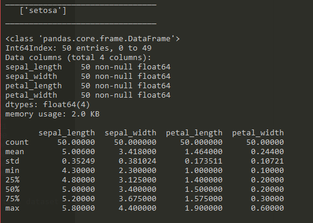
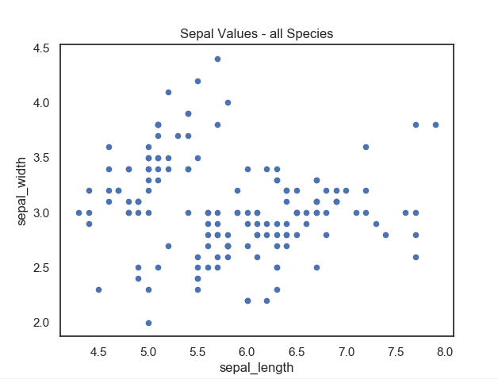

# Project 2019 #

### Programming and Scripting ###

## Galway Mayo Institute of Technology ##

 

**Student Name:** Seamus Leonard

**Student ID:** G00376550

**Contents**

<a href=#exec>Executive Summary </a>

<a href=#instr>Instructions</a>

<a href=#back>Background</a>

<a href=#data>The Data</a>

<a href=#anal>High level analysis</a>

<a href=#vis>Visual analysis</a>

<a href#=app1>Appendix A</a>

<a href=#app2>Appendix B</a>

<a href=#bibleo>Bibliography</a>

 

<h2 id="exec">Executive Summary</h2>
=================

The Iris dataset is a dataset of the measurements of petals and sepals
of three species of Iris flowers. Published in 1936 by Ronald Fisher, it
has become more fully known as the Fisher Iris Dataset. There are
purportedly a number of versions of the dataset, some with stated
errors.

Due to the integrity and uniformity of the dataset and the clear
relationship between the values and the respective species of Iris
flower, it is used as a dataset for Machine Learning. However, this
document is designed to inform the reader about the dataset itself such
that the reader can, without having viewed the dataset, talk with
confidence of its contents.

The dataset has the following description

-   There are 150 rows of data in 4 columns (excluding the species name
    column)
-   The data is divided evenly between three species of flower such that
    each species has 50 rows of data
-   The three species of Iris flower are:

<!-- -->

-   *Setosa*
-   *Versicolor*
-   *Virginica*

<!-- -->

-   From the analysis further in this document we can say that:

<!-- -->

-   The petal length & width clearly distinguish *I. Setosa* from the
    other two species
-   The remaining two species (*I. Versicolor & I. Virginica*) can be
    distinguished with reasonable confidence based on cross-comparison
    of the petal and sepal dimensions.
-   More specifically, it is possible, with sepal width and length
    measurements to identify the species of Iris flower which can be
    validated against the petal length and width

<!-- -->

-   \
     

Instructions {#calibre_link-2 .block_10}
============

This document is paired with two pieces of software which are co-located
in this repository. These are:

[- ]{.bullet_}[Project2019.py]{.calibre6}

[- ]{.bullet_}[basicData.py]{.calibre6}

It is important that when you are saving the software that they are
saved in the same folder as this document.

Running the software requires that you have Python installed. This
software and installation instructions can be downloaded from
[www.python.org](http://www.python.org){.text_}. However, if you are
using Python, you will need to install the PANDAS, NUMPY and SEABORN
packages. However, if you download and install Anaconda Python
([www.anaconda.com](http://www.anaconda.com){.text_} ) these packages
come pre-installed.

Whilst the software can be run from Windows Shell (search for CMD from
the taskbar), a useful tool which interacts well with Anaconda is CMDer
which can be downloaded from
[www.cmder.net](http://www.cmder.net){.text_} .

From either of these Command Line Interface tools, move to the folder
you’ve saved this document and the scripts to using ‘CD \[path\]’. Once
you’re in the folder enter ‘Python’ followed by a space and then the
name of the script you wish to run. The software runs from beginning to
end. With ‘Project2019.py’, a sequence of graphs will be displayed. In
each instance you have the opportunity to save the graph as an image
using the save icon (floppy disk image). However, you must close each
graph in turn to proceed to the next graph. This is done by clicking on
the ‘X’ at the top right of the graph screen.

Background {#calibre_link-3 .block_10}
==========

The Iris Dataset was collected by Edgar Anderson in 1935 and published
by Ronald Fisher in 1936 (Wikipedia, 2019). It is a set of measurements
of three species of Iris flowers. The measurements taken are:

-   Petal length
-   Petal width
-   Sepal length
-   Sepal width

{.calibre7}

Photo 1 Iris Flowers (Willems, 2018)

Fifty of these measurements were recorded for each of the three species
of Iris flower giving a dataset of 150 rows and 5 columns. The
measurements of width and length are decimal numbers to one decimal
place precision. The fifth column holds a text value denoting which
species of Iris flower the measurements are associated with.

However, recent studies have shown that there is more than one Iris data
set in the public domain. Indeed, Bezdek et al (Bezdek, 1999) found that
there is at least one other version which has errors in the dataset.

Notwithstanding the above, the Iris dataset (in its various versions)
has been used both as a pedagogical tool and as a test dataset for
Machine Learning (ML) algorithms (Joseph, 2018). Machine Learning being
defined as “teaching computers how to learn without the need to be
programmed for specific tasks. In fact, the key idea behind ML is that
it is possible to create algorithms that learn from and make predictions
on data” (Maglaras, 2018)

This document will explore the Iris dataset with a view to describing it
such that the reader can know what it contains and tells.

 

The Data {#calibre_link-4 .block_10}
========

High Level overview {#calibre_link-5 .block_20}
-------------------

As with any dataset, the first step in the process is to visually look
through the dataset to:

1.  Understand what the data contained shows
2.  Get a sense of the data
3.  Be aware of any errors or anomalies
4.  Know the key attributes of the data

### Visual inspection {#calibre_link-6 .block_25}

Having browsed visually over the data, all columns seem to be
homogenous. However, we can get Python to perform a quick overview of
the data using *info()*. From this we have:

{.calibre8}

Screen-grab 1 Information

This shows that:

-   There are 150 rows in the data
-   There are 5 columns in the data
-   There are no *NULL* values in any of the data
-   The 4 length and width columns are decimal data (float64)
-   Each column has a specific label

### Closer examination {#calibre_link-7 .block_25}

We can further see from counting the rows by ‘species’ type that:

{.calibre9}

Screen-grab 2 Value Counts

This shows that the data is spread evenly amongst three values in
‘species’. Namely; ‘virginica’, ‘setosa’ and ‘versicolor’ with 50 rows
of data each.

Two separate scripts were written to examine the dataset. The code for
the first of these, from which the graphs in this document were derived,
can be seen in Appendix A. The second script which provides a high-level
analysis of the dataset can be seen in Appendix B.

High level analysis {#calibre_link-8 .block_10}
===================

The data {#calibre_link-9 .block_20}
--------

The Iris dataset contains three subsets of data. One for each species of
Iris in the dataset. In looking at the data we can parse the dataset
into its three subsets and examine the data from the following
standpoints:

-   Is the data intact. Are there empty values, gaps, errors?
-   What are the maximum, minimum, standard deviation, mean and
    Inter-quartile range (IQR) values?
-   Are there outliers in the data subsets?

If the data is intact and have no (or almost no) outliers then we can
start to make assumptions (prove hypotheses) based on the data.

Subsets {#calibre_link-10 .block_20}
-------

From ‘Screen Grab 2 Value Counts’ above, we can see there are three
distinct species of Iris referred to in the dataset. These are:

-   Setosa
-   Virginica
-   Versicolor

Using the modules PANDAS and NUMPY within Python, we can import the
data, examine it for outliers and report on the variables (Min, Max,
Mean, StDev & IQR)

The script in Appendix B was designed such that (with little
modification) it can be used on any similar dataset containing numerical
variables for given groups.

The output from this analysis is as follows:

### Setosa {#calibre_link-11 .block_25}

{.calibre10}

Screen-grab 3 - Statistical Values Setosa

 

### Versicolor {#calibre_link-12 .block_25}

{.calibre11}

Screen-grab 4 Statistical Values Versicolor

 

### Virginica {#calibre_link-13 .block_25}

{.calibre12}

Screen-grab 5 Statistical Values Virginica

\
 

 

Conclusion {#calibre_link-14 .block_20}
----------

In summary, in the Iris dataset there are four numerical variables and
one categorical variable with 50 rows of data in each category and no
null values. Except for one value in one species, there are no outliers,
no errors and no null values in the dataset.

As a result of this, the raw data would suggest that we may be able to
distinguish between three species of the Iris flower based on four
measurements. However, whilst looking at the statistical data values
will assist the reader in understanding the differences between the Iris
species, it is in visualising the data; seeing how the data is displayed
on a chart that the reader can immediately tell the differences in the
data.

Visual analysis {#calibre_link-15 .block_10}
===============

Whereas a visual inspection of raw data will give us an understanding of
the integrity of the data, using python, we can start to examine the
Iris dataset at a high level visually. Being able to see how the data is
represented on a graph gives us a more immediate decision on what the
data is telling us.

Sepal length v. Sepal width {#calibre_link-16 .block_20}
---------------------------

Plotting all values in Sepal length against Sepal width we get:

{.calibre14}

Graph 1 Plot of all sepal values

At first glance in Graph 1, we can see that the data largely aggregates
into two suggestive groups. The first predominantly in the upper left
quadrant and the second predominantly in the lower left and right
quadrants. Further use of python to identify the values in the scatter
plot by species shows us:

 

{.calibre15}

Graph 2 Plot of all sepal values by Species

This shows us that our first observation above was correct in that the
values which aggregated into the upper left quadrant belong to one
species (*Setosa*) This group would appear to have few outliers.
Furthermore, in the more scattered second group in the lower left and
right quadrants, we can now see that within this range are two fairly
distinct groups with those in the lower left quadrant belonging
predominantly to *Versicolor* and the remainder belonging to
*Virginica*. However, the values for *Virginica* are well scattered.

Petal length v. Petal width {#calibre_link-17 .block_20}
---------------------------

Similarly, plotting all values in Petal length against Petal width we
get:

{.calibre16}

Graph 3 Plot of all petal values

However, in the above graph of all petal values we can see the data is
divided clearly into two groups. The first in the lower left quadrant
(small petal width and length) and the second group largely within the
upper right quadrant (large petal width and length).

As with the Sepal values we can identify the values by species giving
us:

{.calibre17}

Graph 4 Plot of all petal values by Species

The above graph shows us more clearly that species *Setosa* again is a
distinct and different set of values to the other two species. However,
in the Petal values we can see a clearer distinction between the
remaining two species (*Versicolor* and *Virginica*).

{.calibre18}

Sepal length

Sepal length

Sepal width

Sepal width

Petal length

Petal length

Petal width

Petal width

Graph 5 Graph-Grid of all variables

 

From the above grid of plots it is clear that from this dataset we can
identify the species of Iris based on the interrelationship between the
Sepal length, Septal width, Petal length and Petal width. This is more
clearly shown in the radial visualisation plot below:

{.calibre19}\
 

Appendix A – Graph plot script {#calibre_link-18 .block_10}
==============================

\# This script processes the Fisher Iris Dataset

\# Seamus Leonard 12/04/2019

\#

 

\#Set working directory and load data

 

\# import packages

[import]{.text_1}[ os]{.text_2}

[import]{.text_1}[ pandas ]{.text_2}[as]{.text_1}[ pd]{.text_2}

[import]{.text_1}[ matplotlib.pyplot ]{.text_2}[as]{.text_1}[
plt]{.text_2}

[import]{.text_1}[ warnings ]{.text_2}[\# apparently seaborn generates a
lot of warnings. This line and the next ignores them]{.text_3}

[warnings.filterwarnings(]{.text_2}['ignore']{.text_4}[)]{.text_2}

[import]{.text_1}[ seaborn ]{.text_2}[as]{.text_1}[ sns ]{.text_2}[\#
this is a visualisation package based on matplotlib
https://seaborn.pydata.org/]{.text_3}

\# set the plot background to white

[from]{.text_1}[ pandas.tools.plotting ]{.text_2}[import]{.text_1}[
radviz]{.text_2}

 

[sns.set(]{.text_2}[style]{.text_5}[=]{.text_2}["white"]{.text_4}[,
]{.text_2}[color\_codes]{.text_5}[=]{.text_2}[True]{.text_6}[)]{.text_2}

 

\# the following code was sourced from:

\#
https://towardsdatascience.com/neural-network-on-iris-data-4e99601a42c8

\# point to the folder where the dataset is located

[try]{.text_1}[:]{.text_2}

[[
]{.calibre20}]{.text_2}[os.chdir(]{.text_2}['D:]{.text_4}[\\\\]{.text_7}[Programming
and Scripting]{.text_4}[\\\\]{.text_7}[Project']{.text_4}[)]{.text_2}

[[ ]{.calibre20}]{.text_2}[\# load the dataset]{.text_3}

[[ iris =
]{.calibre20}]{.text_2}[pd.read\_csv(]{.text_2}['IrisDataset.csv']{.text_4}[)]{.text_2}

[[
]{.calibre20}]{.text_2}[iris.columns=\[]{.text_2}['sepal\_length']{.text_4}[,]{.text_2}['sepal\_width']{.text_4}[,]{.text_2}['petal\_length']{.text_4}[,]{.text_2}['petal\_width']{.text_4}[,]{.text_2}['species']{.text_4}[\]]{.text_2}

[except]{.text_1}[:]{.text_2}

[[ ]{.calibre20}]{.text_2}[print]{.text_8}[(]{.text_2}["Couldn't load
the data"]{.text_4}[)]{.text_2}

\# keep the user informed of the state of the process

[print]{.text_8}[(]{.text_2}['Data loaded']{.text_4}[)]{.text_2}

[print]{.text_8}[()]{.text_2}

\# the following code was sourced from:

\# https://www.kaggle.com/jchen2186/machine-learning-with-iris-dataset

\# provide the user with an overview of the dataset

[print]{.text_8}[(iris.info())]{.text_2}

[print]{.text_8}[()]{.text_2}

\# provided the user with a high-level report on data breakdown

[print]{.text_8}[(iris\[]{.text_2}['species']{.text_4}[\].value\_counts())]{.text_2}

 

\# the following code was sourced from:

\#http://www.learn4master.com/machine-learning/visualize-iris-dataset-using-python

 

[iris.plot(]{.text_2}[kind]{.text_5}[=]{.text_2}['scatter']{.text_4}[,]{.text_2}[x]{.text_5}[=]{.text_2}['sepal\_length']{.text_4}[,
]{.text_2}[y]{.text_5}[=]{.text_2}['sepal\_width']{.text_4}[)]{.text_2}

[plt.title(]{.text_2}['Sepal Values - all Species']{.text_4}[)]{.text_2}

plt.show()

 

[iris.plot(]{.text_2}[kind]{.text_5}[=]{.text_2}['scatter']{.text_4}[,
]{.text_2}[x]{.text_5}[=]{.text_2}['petal\_length']{.text_4}[,]{.text_2}[y]{.text_5}[=]{.text_2}['petal\_width']{.text_4}[)]{.text_2}

[plt.title(]{.text_2}['Petal Values - all Species']{.text_4}[)]{.text_2}

plt.show()

 

[sns.FacetGrid(iris,
]{.text_2}[hue]{.text_5}[=]{.text_2}['species']{.text_4}[,
]{.text_2}[size]{.text_5}[=]{.text_2}[5]{.text_9}[) \\]{.text_2}

[[ ]{.calibre20}]{.text_2}[.map(plt.scatter,
]{.text_2}['sepal\_length']{.text_4}[,
]{.text_2}['sepal\_width']{.text_4}[) \\]{.text_2}

[ ]{.calibre20}.add\_legend()

[plt.title(]{.text_2}['Sepal values by Species']{.text_4}[)]{.text_2}

plt.show()

 

[sns.FacetGrid(iris,
]{.text_2}[hue]{.text_5}[=]{.text_2}['species']{.text_4}[,]{.text_2}[size]{.text_5}[=]{.text_2}[5]{.text_9}[)\\]{.text_2}

[[
]{.calibre20}]{.text_2}[.map(plt.scatter,]{.text_2}['petal\_length']{.text_4}[,]{.text_2}['petal\_width']{.text_4}[)\\]{.text_2}

[ ]{.calibre20}.add\_legend()

[plt.title(]{.text_2}['Petal values by Species']{.text_4}[)]{.text_2}

plt.show

 

[sns.pairplot(iris,
]{.text_2}[hue]{.text_5}[=]{.text_2}["species"]{.text_4}[,
]{.text_2}[size]{.text_5}[=]{.text_2}[3]{.text_9}[,
]{.text_2}[diag\_kind]{.text_5}[=]{.text_2}["kde"]{.text_4}[)]{.text_2}

plt.show()

 

[radviz(iris,]{.text_2}['species']{.text_4}[)]{.text_2}

[plt.title(]{.text_2}['Radial visualisation of Iris
dataset']{.text_4}[)]{.text_2}

plt.show()

 

 

Appendix 2 – High level analysis script {#calibre_link-19 .block_10}
=======================================

\# This script is solely to return numerical data from the Iris Dataset

\# and is devoid of graphs

\#

\# Written by Seamus Leonard G00376550 26/04/2019

 

\# The script will return the following calculations:

\# Max, Min, Standard Deviation, Inter-quartile range

 

\# first import the necessary packages

[import]{.text_1}[ os]{.text_2}

[import]{.text_1}[ pandas ]{.text_2}[as]{.text_1}[ pd ]{.text_2}

[import]{.text_1}[ numpy ]{.text_2}[as]{.text_1}[ np]{.text_2}

 

\# the following code was sourced from:

\#
https://towardsdatascience.com/neural-network-on-iris-data-4e99601a42c8

\# point to the folder where the dataset is located

[try]{.text_1}[:]{.text_2}

[[
]{.calibre20}]{.text_2}[os.chdir(]{.text_2}['D:]{.text_4}[\\\\]{.text_7}[Programming
and Scripting]{.text_4}[\\\\]{.text_7}[Project']{.text_4}[)]{.text_2}

[[ ]{.calibre20}]{.text_2}[\# load the dataset]{.text_3}

[[ iris =
]{.calibre20}]{.text_2}[pd.read\_csv(]{.text_2}['IrisDataset.csv']{.text_4}[)]{.text_2}

[[
]{.calibre20}]{.text_2}[iris.columns=\[]{.text_2}['sepal\_length']{.text_4}[,]{.text_2}['sepal\_width']{.text_4}[,]{.text_2}['petal\_length']{.text_4}[,]{.text_2}['petal\_width']{.text_4}[,]{.text_2}['species']{.text_4}[\]]{.text_2}

[except]{.text_1}[:]{.text_2}

[[ ]{.calibre20}]{.text_2}[print]{.text_8}[(]{.text_2}["Couldn't load
the data"]{.text_4}[)]{.text_2}

 

outliers=\[\]

 

[def]{.text_6}[
]{.text_2}[detect\_outliers]{.text_8}[(]{.text_2}[d1]{.text_5}[):]{.text_2}

[[ ]{.calibre20}]{.text_2}[\# this code was taken from]{.text_3}

[[ ]{.calibre20}]{.text_2}[\#
https://medium.com/datadriveninvestor/finding-outliers-in-dataset-using-python-efc3fce6ce32]{.text_3}

[[ threshold=]{.calibre20}]{.text_2}[3]{.text_9}

[ mean\_1=]{.calibre20}np.mean(d1)

[ std\_1=]{.calibre20}np.std(d1)

[[ ]{.calibre20}]{.text_2}[for]{.text_1}[ y ]{.text_2}[in]{.text_6}[
d1:]{.text_2}

[ ]{.calibre20}z\_score= (y-mean\_1)/std\_1

[[ ]{.calibre20}]{.text_2}[if]{.text_1}[ np.abs(z\_score) &gt;
threshold:]{.text_2}

[ ]{.calibre20}outliers.append(y)

[[ ]{.calibre20}]{.text_2}[return]{.text_1}[ outliers]{.text_2}

 

[def]{.text_6}[
]{.text_2}[return\_values]{.text_8}[(]{.text_2}[d1]{.text_5}[):
]{.text_2}

[[ ]{.calibre20}]{.text_2}[\# this SR is superfluous but left here to
show how the details of .describe() can be achieved]{.text_3}

[[ ]{.calibre20}]{.text_2}[print]{.text_8}[(]{.text_2}['Mean Value:
']{.text_4}[, np.mean(d1))]{.text_2}

[[ ]{.calibre20}]{.text_2}[print]{.text_8}[(]{.text_2}['Std Dev:
']{.text_4}[, np.std(d1))]{.text_2}

[[
Q1=]{.calibre20}]{.text_2}[np.quantile(d1,]{.text_2}[0.25]{.text_9}[)]{.text_2}

[[
Q3=]{.calibre20}]{.text_2}[np.quantile(d1,]{.text_2}[0.75]{.text_9}[)]{.text_2}

[[ ]{.calibre20}]{.text_2}[print]{.text_8}[(]{.text_2}['IQR:
']{.text_4}[, Q3-Q1)]{.text_2}

[[ ]{.calibre20}]{.text_2}[print]{.text_8}[()]{.text_2}

[[ ]{.calibre20}]{.text_2}[print]{.text_8}[()]{.text_2}

 

Species = iris.species.unique()

[for]{.text_1}[ sp ]{.text_2}[in]{.text_6}[ Species:]{.text_2}

[[ ]{.calibre20}]{.text_2}[\# the code for deriving subsets\*\* of
datasets was learned from]{.text_3}

[[ ]{.calibre20}]{.text_2}[\#
https://cmdlinetips.com/2018/02/how-to-subset-pandas-dataframe-based-on-values-of-a-column/]{.text_3}

[[ dt=iris\[iris\[]{.calibre20}]{.text_2}['species']{.text_4}[\]==sp\]
]{.text_2}[\# \*\*]{.text_3}

[[ ]{.calibre20}]{.text_2}[speciesName=dt.species.unique()
]{.text_2}[\#sourced from
https://chrisalbon.com/python/data\_wrangling/pandas\_list\_unique\_values\_in\_column/]{.text_3}

[[
dt=]{.calibre20}]{.text_2}[dt.drop(]{.text_2}[columns]{.text_5}[=]{.text_2}['species']{.text_4}[)]{.text_2}

[[
]{.calibre20}]{.text_2}[print]{.text_8}[(]{.text_2}['\_\_\_\_\_\_\_\_\_\_\_\_\_\_\_\_\_\_\_\_\_\_\_\_\_\_\_\_\_\_\_\_']{.text_4}[)]{.text_2}

[[ ]{.calibre20}]{.text_2}[print]{.text_8}[(]{.text_2}[['
']{.calibre20}]{.text_4}[,speciesName)]{.text_2}

[[
]{.calibre20}]{.text_2}[print]{.text_8}[(]{.text_2}['\_\_\_\_\_\_\_\_\_\_\_\_\_\_\_\_\_\_\_\_\_\_\_\_\_\_\_\_\_\_\_\_']{.text_4}[)]{.text_2}

[[ ]{.calibre20}]{.text_2}[print]{.text_8}[()]{.text_2}

[ ]{.calibre20}dt.info()

[[ ]{.calibre20}]{.text_2}[print]{.text_8}[()]{.text_2}

[[ ]{.calibre20}]{.text_2}[print]{.text_8}[(dt.describe())]{.text_2}

[[ ]{.calibre20}]{.text_2}[print]{.text_8}[()]{.text_2}

[[ ]{.calibre20}]{.text_2}[print]{.text_8}[()]{.text_2}

[[ ]{.calibre20}]{.text_2}[print]{.text_8}[(]{.text_2}['The following
information is available for the columns in this
dataset']{.text_4}[)]{.text_2}

[[ ]{.calibre20}]{.text_2}[print]{.text_8}[()]{.text_2}

 

[[
]{.calibre20}]{.text_2}[dsCols=]{.text_2}[list]{.text_10}[(dt.columns.values)
]{.text_2}

[[
]{.calibre20}]{.text_2}[\#https://stackoverflow.com/questions/19482970/get-list-from-pandas-dataframe-column-headers]{.text_3}

 

[[ ]{.calibre20}]{.text_2}[for]{.text_1}[ dsC ]{.text_2}[in]{.text_6}[
dsCols:]{.text_2}

[ d1=dt\[]{.calibre20}dsC\]

[[ ]{.calibre20}]{.text_2}[print]{.text_8}[(speciesName,dsC,]{.text_2}['
outliers:']{.text_4}[)]{.text_2}

[[
]{.calibre20}]{.text_2}[print]{.text_8}[(detect\_outliers(d1))]{.text_2}

[[ ]{.calibre20}]{.text_2}[\#return\_values(d1)]{.text_3}

[[ ]{.calibre20}]{.text_2}[\#the above line was commented out as the
.describe() method provides]{.text_3}

[[ ]{.calibre20}]{.text_2}[\#the same details in a more tabular
form]{.text_3}

[ ]{.calibre20}outliers.clear()

\
 

\
  {#section .block_10}
=

Bibliography {#calibre_link-20 .block_10}
============

(anonymous), c. (2018, February 22). *How to filter Pandas dataframe by
values of column*. Retrieved from cmdline Tips:
https://cmdlinetips.com/2018/02/how-to-subset-pandas-dataframe-based-on-values-of-a-column/

(anonymous), T. D. (2017, September 5). *Exploring the Iris Dataset*.
Retrieved from Medium.com:
https://medium.com/@livingwithdata/exploring-the-iris-dataset-260cc1e5cdf7

Anonymous. (2016, August 9). *Visualise Iris Dataset using Python*.
Retrieved from Learn 4 Master:
http://www.learn4master.com/machine-learning/visualize-iris-dataset-using-python

Bezdek, J. C. (1999, June). Will the real Iris data please stand up?
*IEEE Transactions on Fuzzy Systems, 7*(3), pp. 368-369.

Brownlee, J. (2016, June 10). *Your first Machine Learning Project in
Python Step-by-Step*. Retrieved from Machine Learning Mastery:
https://machinelearningmastery.com/machine-learning-in-python-step-by-step/

Chen, J. (2018). *Machine Learning with Iris Dataset*. Retrieved from
Kaggle:
https://www.kaggle.com/jchen2186/machine-learning-with-iris-dataset

Endrinal, F. (2017, September 5). *Exploring the Iris Dataset*.
Retrieved from Medium:
https://medium.com/@livingwithdata/exploring-the-iris-dataset-260cc1e5cdf7

Joseph, R. (2018, July 16). *Neural network on iris data*. Retrieved
from Towards Data Science:
https://towardsdatascience.com/neural-network-on-iris-data-4e99601a42c8

Maglaras, Y. (2018, February 19). *What Machine Learning is Great For*.
Retrieved from Digital List:
https://digitalist.global/talks/machine-learning-great/

Mittapalli, H. (2018, December 24). *Exploratory Data Analysis: Iris
Dataset*. Retrieved from Medium.com:
https://medium.com/@harimittapalli/exploratory-data-analysis-iris-dataset-9920ea439a3e

Waskom, M. (2018). *seaborn: statistical data visualisation*. Retrieved
from seaborn: statistical data visualisation: https://seaborn.pydata.org

Wikipedia. (2019, April 3rd). *Iris Flower data set*. Retrieved from
Wikipedia: https://en.wikipedia.org/wiki/Iris\_flower\_data\_set

Willems, K. (2018, November 20). *Machine Learning in R for beginners*.
Retrieved from datacamp.com:
https://www.datacamp.com/community/tutorials/machine-learning-in-r

